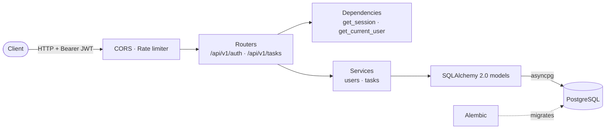
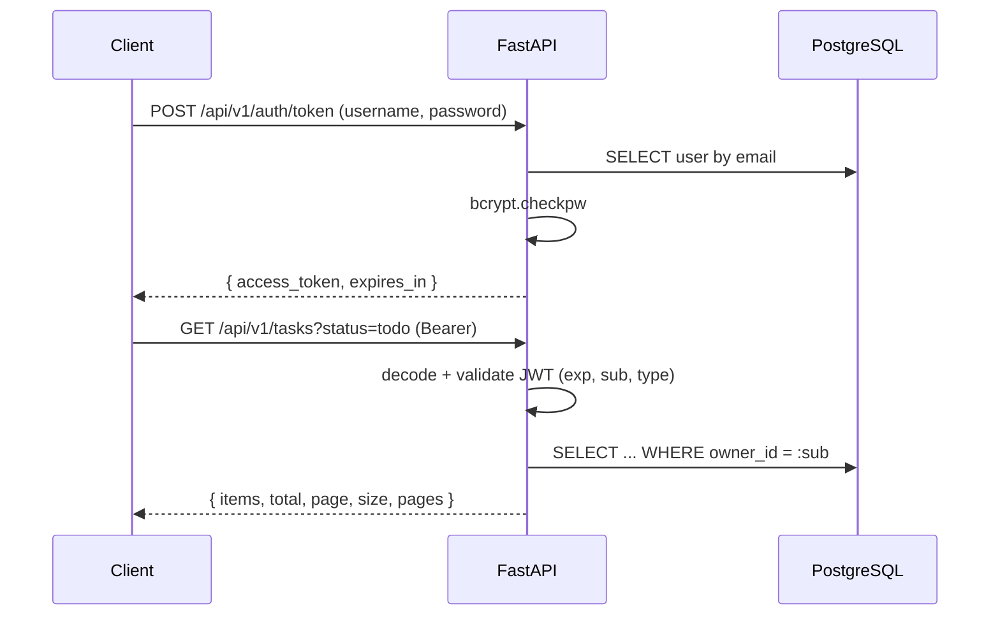

# FastAPI Async CRUD

[](https://github.com/CH88320B/fastapi-async-crud/actions/workflows/ci.yml)


A modern, fully **asynchronous** task-management REST API. It's built with **FastAPI**, **SQLAlchemy 2.0 async** on PostgreSQL (asyncpg), **Alembic** migrations, **Pydantic v2** validation, **OAuth2 password flow + JWT**, and **rate limiting**. It ships with Docker Compose and a pytest suite that runs against in-memory SQLite.

## Features

- **Async end to end**: async SQLAlchemy sessions, asyncpg driver, async tests with `httpx.AsyncClient`
- **OAuth2 + JWT**: `/auth/token` implements the OAuth2 password flow, so Swagger's **Authorize** button works out of the box
- **Per-user data isolation**: every query is scoped to the token's user. Other users' tasks return `404`, which prevents ID probing
- **Filtering, sorting, pagination**: by `status`, `priority`, `search`, `due_before`, sorted by `created_at | due_date | priority | title`
- **Rate limiting** with SlowAPI: a strict limit on auth endpoints (brute-force protection), a default limit elsewhere, keyed by token or IP, and `429` with `Retry-After`
- **Pydantic v2**: normalization (trimmed titles, lower-cased emails), partial updates via `exclude_unset`, and explicit-null guards
- **Alembic** async migrations with a deterministic constraint naming convention. CI checks upgrade → downgrade → upgrade against real PostgreSQL
- **Security details**: bcrypt hashing, constant-time login for unknown emails, 72-byte password cap, token type and required-claim checks

## Architecture





## Getting started

### Docker Compose

```bash
cp .env.example .env
docker compose up --build
```

Migrations run automatically on startup. Open **http://localhost:8000/docs**.

### Local development

```bash
python -m venv .venv && source .venv/bin/activate   # Windows: .venv\Scripts\activate
pip install -e ".[dev]"
cp .env.example .env
docker compose up -d db
alembic upgrade head
uvicorn app.main:app --reload
```

### Tests & lint

```bash
pytest          # async tests on in-memory SQLite, with coverage
ruff check .
```

## API

| Method | Endpoint | Auth | Description |
|--------|----------|------|-------------|
| `POST` | `/api/v1/auth/register` | – | Create an account |
| `POST` | `/api/v1/auth/token` | – | OAuth2 password flow → JWT |
| `GET` | `/api/v1/auth/me` | Bearer | Current user |
| `PATCH` | `/api/v1/auth/me` | Bearer | Update name or password |
| `GET` | `/api/v1/tasks` | Bearer | List with filters, sorting and pagination |
| `POST` | `/api/v1/tasks` | Bearer | Create a task |
| `GET` | `/api/v1/tasks/{id}` | Bearer | Get a task |
| `PATCH` | `/api/v1/tasks/{id}` | Bearer | Partial update |
| `DELETE` | `/api/v1/tasks/{id}` | Bearer | Delete |
| `GET` | `/health` | – | Liveness + DB check |

```bash
curl -X POST localhost:8000/api/v1/auth/register -H 'Content-Type: application/json' \
  -d '{"email":"jane@example.com","full_name":"Jane Doe","password":"s3cure-pass"}'

TOKEN=$(curl -s -X POST localhost:8000/api/v1/auth/token \
  -d 'username=jane@example.com&password=s3cure-pass' | jq -r .access_token)

curl -X POST localhost:8000/api/v1/tasks -H "Authorization: Bearer $TOKEN" -H 'Content-Type: application/json' \
  -d '{"title":"Ship v1","priority":"high","due_date":"2026-12-01"}'

curl "localhost:8000/api/v1/tasks?status=todo&sort=priority&descending=true&page=1&size=10" \
  -H "Authorization: Bearer $TOKEN"
```

## Configuration

| Variable | Default | Description |
|----------|---------|-------------|
| `DATABASE_URL` | `postgresql+asyncpg://…/tasks` | Async SQLAlchemy URL |
| `JWT_SECRET` | – (required, ≥ 32 chars) | HMAC signing key |
| `ACCESS_TOKEN_EXPIRE_MINUTES` | `30` | Token lifetime |
| `RATE_LIMIT_DEFAULT` | `100/minute` | Limit for all endpoints |
| `RATE_LIMIT_AUTH` | `5/minute` | Limit for register and login |
| `CORS_ORIGINS` | `["http://localhost:3000"]` | Allowed origins (JSON list) |

## Project structure

```
app/
├── api/            # routers and dependencies (session, current user)
├── core/           # settings, security (JWT/bcrypt), rate limiting, error handlers
├── db/             # declarative base, async engine and session
├── models/         # SQLAlchemy 2.0 typed models
├── schemas/        # Pydantic v2 request/response models
├── services/       # business logic (users, tasks)
└── main.py
alembic/            # async migration environment + versions
tests/              # pytest-asyncio + httpx
```

## License

[MIT](LICENSE)
